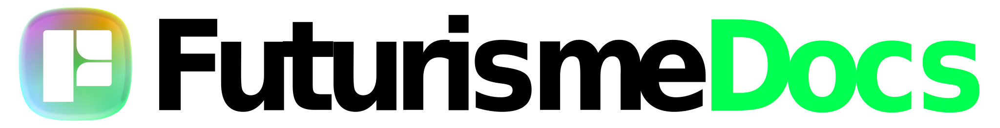

<p align="center">
  <a href="https://store.futurisme.com">
    <picture>
      <source media="(prefers-color-scheme: dark)" srcset="./public/FuturismeLogo-Docs-dark.svg">
      <source media="(prefers-color-scheme: light)" srcset="./public/FuturismeLogo-Docs-light.svg">
      
    </picture>
  </a>
</p>

<h1 align="center">Documentation</h1>

<p align="center">
  <strong>Pusat Dokumentasi Teknis Ekosistem Futurisme Store</strong>
</p>

<p align="center">
  <a href="https://nextjs.org">
    
  </a>
  <a href="https://tailwindcss.com">
    
  </a>
  <a href="https://www.typescriptlang.org">
    
  </a>
</p>

<br />

## 📖 Tentang Project

**Futurisme Documentation** adalah repositori terpisah (*micro-site*) yang didedikasikan untuk menyimpan dokumentasi teknis, panduan penggunaan komponen (Design System), struktur API, dan standar pengembangan untuk aplikasi utama **Futurisme Store**.

Pemisahan ini dilakukan untuk:
- Menjaga kebersihan kode aplikasi utama.
- Memudahkan *onboarding* developer baru.
- Menyediakan referensi visual komponen yang terisolasi.

## ✨ Fitur Utama

- **Dedicated Landing Page**: Halaman muka modern dengan animasi hero section & watermark footer.
- **Dark Mode Support**: Terintegrasi penuh dengan `next-themes` dan Tailwind CSS.
- **Layout Terpisah**:
  - `RootLayout`: Bersih tanpa sidebar (untuk Landing Page).
  - `DocumentationLayout`: Dilengkapi Sidebar & Navbar navigasi (untuk halaman docs).
- **Responsive Design**: Tampilan optimal di Mobile, Tablet, dan Desktop.

## 🛠️ Teknologi yang Digunakan

- **Framework**: [Next.js 14](https://nextjs.org/) (App Router)
- **Styling**: [Tailwind CSS](https://tailwindcss.com/)
- **Icons**: [@iconify/react](https://iconify.design/)
- **Animation**: [Framer Motion](https://www.framer.com/motion/)
- **Theme**: [next-themes](https://github.com/pacocoursey/next-themes)

## 📂 Struktur Folder

Berikut adalah struktur direktori penting dalam project ini:

```bash
futurisme-documentation/
├── public/                  # Aset statis (Logo, Icon, Gambar)
├── src/
│   ├── app/
│   │   ├── documentation/   # Halaman dokumentasi (Layout dengan Sidebar)
│   │   │   ├── components/  # Docs: UI Components
│   │   │   ├── api/         # Docs: API Reference
│   │   │   ├── layout.tsx   # Layout khusus dokumentasi (Sidebar + Navbar)
│   │   │   └── ...
│   │   ├── layout.tsx       # Root Layout (Clean/Kosong)
│   │   └── page.tsx         # Landing Page Utama
│   ├── components/
│   │   ├── Documentation/   # Komponen UI khusus layout docs (Sidebar/Navbar)
│   │   ├── Landing/         # Komponen UI khusus Landing Page (Hero, Footer)
│   │   ├── Theme/           # Theme Switcher & Providers
│   │   └── LogoDefault.tsx  # Komponen Logo Utama
│   └── lib/                 # Utilitas (cn, helpers)
└── ...
````

## 🚀 Cara Menjalankan (Local Development)

Pastikan Anda telah menginstal **Node.js** (versi 18+ direkomendasikan).

1.  **Clone Repository**

    ```bash
    git clone https://github.com/username/futurisme-documentation.git
    cd futurisme-documentation
    ```

2.  **Install Dependencies**

    ```bash
    npm install
    # atau
    yarn install
    ```

3.  **Jalankan Development Server**

    ```bash
    npm run dev
    ```

4.  **Buka di Browser**
    Akses [http://localhost:3000](https://www.google.com/search?q=http://localhost:3000) untuk melihat hasilnya.

## 🎨 Aset Logo

Project ini menggunakan 3 variasi logo yang tersimpan di folder `/public`:

| File | Keterangan |
| :--- | :--- |
| `FuturismeLogo-Docs.svg` | Logo Icon saja (Simbol Buku/Store) |
| `FuturismeLogo-Docs-light.svg` | Logo + Teks warna gelap (untuk Light Mode) |
| `FuturismeLogo-Docs-dark.svg` | Logo + Teks warna putih (untuk Dark Mode) |

## 🤝 Kontribusi

Jika Anda ingin menambahkan halaman dokumentasi baru:

1.  Buat folder baru di dalam `src/app/documentation/`.
2.  Buat file `page.tsx`.
3.  Tambahkan link menu baru di file `src/data/sidebarMenu.json` (jika menggunakan JSON) atau langsung di `src/components/Documentation/DocsSidebar.tsx`.

-----

<p align="center">
&copy; 2024 Futurisme Store Development Team. All rights reserved.
</p>

```
```